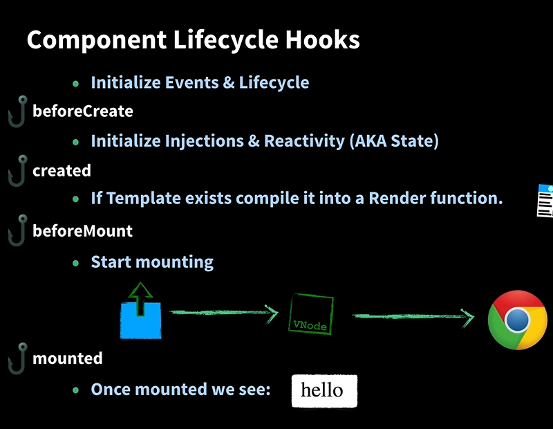

### 1.LifeHooks OverView

#### vue2.x 

1. beforeCreate => created => beforeMount => mounted => beforeDestroy => destroyed

   ​                                                                                             (beforeUpdate => updated)

2. keep-alive组件特有: activated , deactivated
3. errorCaptured

#### vue 3.0

1. setup() => onBeforeMount => onMounted => onBeforeDestroy => onDestroyed

​                                                               (onBeforeUpdate=>onUpdated)

2. onErrorCaptured
3. New hooks:    onRenderTracked , onRenderTriggered
4. **Use setup() to take place of beforeCreate and created**
5. Setup() is invoked after beforeCreate () , and right before created()

### 2. From Vue Mastery Courses:



Vue 2 already uses proxy to detect whether the property exists in current component in development mode.

And **we can use this.somthingindata instead of this._data.somthingindata** all because of ` proxies`.

(To improve developers experiences ?) (Works only for browser supporing proxies)

```js
function InitState(){
    initLifecycle(vm)     //setup and teardown doms?
    initEvents(vm)       //like what? $on,$emit , methods on Vue instance
    initRender(vm)       //setup the render and update methods
    callHooks(vm,beforeCreate)
    initInjections()
    initState()
    initProvide()
    callHooks(vm,created)
}
function initState(){
    initProps();
    initMethods();            //记住这个顺序!
    initData();
    initComputed();
    initWatch();
}
```

* **Plugins like vuex and vue-router inject their properties inside the method beforeCreate(), meaning that those injections (like $store.state) can be used in components data and methods(?)** 

* You can use props inside the data function ,but you can' t use the way around.e.g. You can not use data in props' default functions. Same as data and comptued. Use data in computed but not use the computed functions in data(?)

  ```js
  props:{
      propsA:{
          type:Number,
          default:function(){
             return SomethingInData      //wrong
          }
      }
  }
  data:{
      return {
          SomthingInData:'22'
      }
  }
  ```

  

#### Mounting Process

templates ===> render functions ===> VNodes    ===> Browsers

​        (Happen on server / client side )               (Only on client side )

When you use Vue-cli2.x to build a project, you can choose:

runtime-with-compiler: larger in size (32kb)

runtime-only (22kb)

`If I pick runtime-only , I must put all my templates in .vue files.`

```js
if(vm.$options.el){
    vm.$mount(vm.$options.el)  //$mount method may be different based on the running env.
}
//inside the $mount function
const options = this.$options
//if there's no render functions, check if there a template exists.
if(!options.render){              
    if(template){
        //If it does, then compile the template into render functions
        const {render , staticRenderFns} = compileToFunctions(...)            
    }
}
const VNode = render() //Render functions return VNodes
    
```

"**Pseudo Procedure**"

1. **Compile templates to render functions**
2. beforeMount()
3. **Execute render functions and load VNodes on the browser。（Where the DIFF Algorithm starts???No, first time rendering）**

4. mounted()

#### Question: Why we use Virtual DOM?

Answer: First compare ,then update the difference with least cost

Abstraction of DOM , render function => virtual DOM => Browser(Or Android/Weex)

​                                      Components               VDOM                   Platform

VDOM requires some real DOM manipulations to load nodes on platform pages

like document.createTextNode/  document.createElement.Those actions can be differentiated manully so as to re-utilize them on different platforms.(Another set of functions)

网上看得懂的答案:

1.真实DOM属性比较多,创建成本高.VDOM只创建一些必要的属性,不影响使用且降低了成本

2.可以用DIFF算法先对比差异,再更新差异之处,减少重绘/回流

oldDOMTree < == > newDOMTree          --> DIFF算法找出区别      -->精准更新实际DOMTree

3.将DOM抽象成JS对象,操作成本降低,跨平台能力强.

大佬回答:

"May find certain things that are awkward to  do only with  templates."

"To fully get the power of render functions, and build complex large/ functional components." 

大佬直接能"extract \__patch\__  functions to get the really extra power"

#### Question: What does mount do?

```js
let updateComponent = ()=>{
    vm._update(vm._render(),hydrating)
}
//_render() return VNodes, and _update() load VNodes on browser page.(?)
//First time rendering on website.
new Watcher(vm.updateComponent,noop,null,true)  //?
//Create a watcher to detect and update it once the DOM is changed.?
```

```js
callHooks(vm,beforeUpdate)
//Then compare the old VNode to new Vnode        COLLECTING/COMPARING DIFFERENCES
//updating ...          patch pieces of DOM that changed   EXECUTING/PUTTING INTO EFFECT
callHooks(vm,updated)
```

### 3. DIFF算法[1]

* 1. 父节点相同的节点才会比较


* 2. 父节点相同的节点才会被复用


* 3. 比较逻辑: 先找不需要移动的 , 再找相同但需要移动的, 最后找不到,就去创建和删除节点

     ​                (消耗由小到大)

     

* 4. 三种树, 页面DOM树, 旧VNode树, 新VNode树

     当前页面DOM树与旧VNode树一一对应

     新VNode树(Blueprint)是页面DOM树更新后该有的样子

     先找出不同再投入实际操作,而不是整个重建.

* 5. 例子:

     

     第一步比较:成本最低的开始.实际DOM树该节点不变


​                 第二步比较: 找移动了但之前就存在的节点.实际DOM中移动它.


​                     第三步比较: 找新增的,删除了的.创建插入并删除不存在了的节点:


[1]DIFF参考:https://juejin.im/post/5d75afec6fb9a06aeb10e354