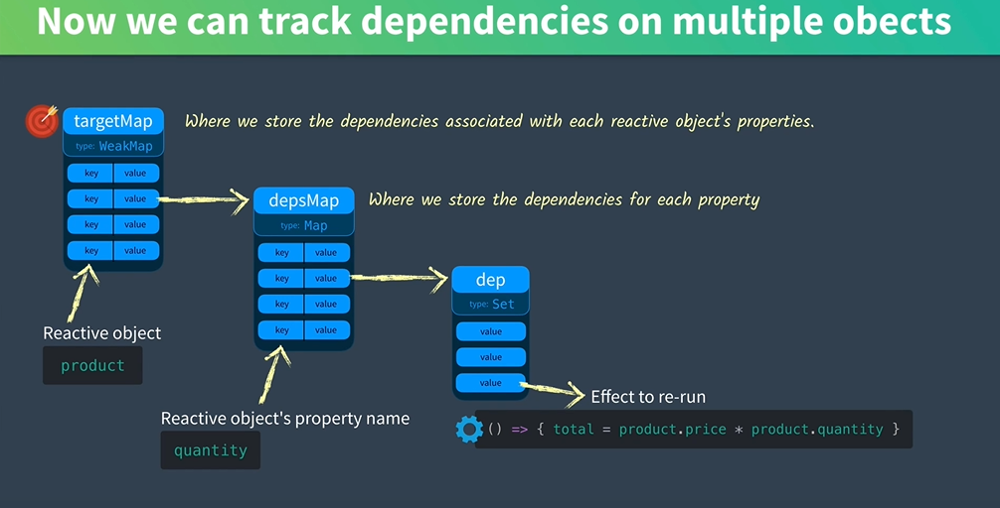

### 1.Storing different effects

```js
let targetMap = new WeakMap()
function track(target,key){
    let depsMap = targetMap.get(target)
    if(!depsMap){
        targetMap.set(target,(depsMap = new Map()))
    }
    let dep = depsMap.get(key)
    if(!dep){
        depsMap.set(key,(dep = new Set()))
    }
    //How to know where are the effects? and collect them?
    //Once the property is accessed, there'll be an effect
    dep.add(effect)
}

function trigger(target,key){
    const depsMap = targetMap.get(target)
    if(!depsMap) {return}
    let dep = depsMap.get(key)
    if(dep){
        dep.forEach(effect => {
            effect()
        })
    }
}

let product = {
    price:10,
    quality:2
}
let total = 0
let effect = ()=>{
    total = product.price * product.quality
}
track(product,'quality')
console.log(total)         //0
product.quality = 3
trigger(product,'quality')   //30
console.log(total)
```

* A WeakMap to store the Object Names;

* A Map to store Objects' Properties;

* A Set to store Properties' dependencies



---

### 2.Run track() and trigger() automatically

* Using `Reflect.get(product,'quantity')` can also access the value of the property, same with using `product.quantity` or `product['quantity']`

**Question**: Why do we have to use `return Reflect.get()` intead of directly using return when we intercept an object's property?

**Answer**: Ensures the proper value of `this` is used when our object has inherited values or functions from another object.(To do or not to do ?)

```js
function reactive(target){
    const handler = {
        get(target,key,receiver){
            let result = Reflect.get(target,key)
            track(target,key)
            return result
        },
        set(target,key,value,receiver){
            let oldValue = target[key]
            let result = Reflect.set(target,key,value,receiver)
            if(oldValue != result){
                trigger(target,key)
            }
            return result
        }
    }
    return new Proxy(target,handler)
}
//test
let product = reactive({price:10,quantity:2})
let total = 0 
let effect = ()=>{total = product.price * product.quantity}

effect()         //why have to run it ?  problem
console.log(total)        //20
product.quantity = 4
console.log(total)      //40
```

### 3.Run the track only in our effect()

```js
console.log(product.quatity) 
//this will run the track() to run the deps, which is not what we want(?)
//Q:How to judge whether it's called in active effect?
//A:Only functions that change the value will be added to dep Set.
//SOLUTION:
let activeEffect = null
function effect(eff){
     activeEffect = eff    //绝对不能用let再定义activeEffect
     activeEffect()
     activeEffect = null;
}
//Run it once it was defined?
//Where's the definition of effect?
//Redefine the track() method:
function track(target,key){
    if(activeEffect){  
        let depsMap = targetMap.get(target)
      if(!depsMap){
        targetMap.set(target,(depsMap = new Map()))
    }
      let dep = depsMap.get(key)
      if(!dep){
        depsMap.set(key,(dep = new Set()))
    }
      dep.add(activeEffect)
      
    }
}
```

### 4.Computed() 

```js
function computed(getter){
    let result = ref()
    effect(()=>(result.value = getter()))
    //make it an 'effect', and return it.
    return result
}
//Inner value computations.
computed(()=>{return product.price * 0.9})
```

### 5.Vue 2 Limitation

* We can't manually add reactive properties to object in the Vue instance

  ```js
  data:{
      return {
          product:{
              price:5,
              quantity:3
          }
      }
  }
  product.name = 'Shoes'
  product.name = 'Socks'
  //this will not run the effect() again.So the name remains 'Shoes'
  //Solution:
  Vue.set('product','name','Socks') //kind of ugly(?)
  ```

  